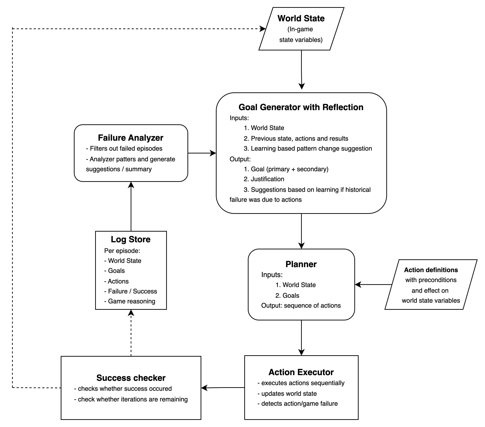

# Dungeon Guardian 🛡️

An intelligent AI agent designed to protect treasures in a dynamic dungeon environment using advanced decision-making capabilities powered by LangGraph and large language models.

## 🎯 Overview

Dungeon Guardian is a sophisticated AI agent that operates in a simulated dungeon environment where it must:
- **Survive** against various enemy threats
- **Protect valuable treasures** from hostile forces  
- **Make strategic decisions** balancing risk and reward
- **Learn from experiences** to improve future performance

The agent uses a graph-based architecture with multiple specialized nodes that handle goal generation, planning, action execution, and learning from both successes and failures.

## 🚀 Getting Started

### Prerequisites
- Python 3.13+
- OpenAI API key (or other supported LLM provider)

### Environment Setup

Create a `.env` file in the project root with your API credentials. Refer to `.env.example` to setup the environment variables.

### Option 1: Using uv (Recommended)

If you have [uv](https://docs.astral.sh/uv/) installed:

```bash
# Clone the repository
git clone https://github.com/your-username/dungeon-guardian.git
cd dungeon-guardian

# Install dependencies and run
uv run python main.py
```

### Option 2: Using pip/venv

If you prefer traditional Python package management:

```bash
# Clone the repository
git clone https://github.com/your-username/dungeon-guardian.git
cd dungeon-guardian

# Create and activate virtual environment
python -m venv .venv
source .venv/bin/activate  # On Windows: .venv\Scripts\activate

# Install dependencies
pip install -r requirements.txt

# Run the project
python main.py
```

### Usage

#### Single Scenario Mode

Run the main script to start a dungeon guardian session with a single scenario:

```bash
python main.py
```

This will run an interactive session where you can see real-time output showing:
- Current world state
- Generated goals and justifications
- Planned action sequences
- Execution results
- Success/failure analysis
- Learning insights

#### Batch Scenario Mode

Run multiple predefined scenarios for testing and comparison:

```bash
python main_run_batch.py
```

This script runs 5 different scenarios including:
- **Scenario 1**: Low health, no healing resources, enemy nearby
- **Scenario 2**: Healthy agent, treasure under high threat
- **Scenario 3**: No enemy nearby, low stamina, potions available
- **Scenario 4**: Out of potions, enemy present, treasure safe
- **Scenario 5**: Critical situation with multiple threats

Each scenario outputs success/failure status, end reason, and iteration count for performance analysis.

### Configuration

Modify the initial world state in `main.py` to test different scenarios:

```python
world_state = WorldState(
    health=80,
    stamina=80,
    potionCount=2,
    treasureThreatLevel="high",
    enemyNearby=True,
    enemyLevel="very_high",
    isInSafeZone=False,
    isBackup=False,
    treasureHealth=100,
    comfyActions=0
)
```

If configuration parameter adjustment is need, they should be present in `.env` file. All environment variables will be given preference.

## 🏗️ Architecture

The system is built using **LangGraph** and follows a multi-node workflow:



### Core Components

- **Goal Generator**: Analyzes the current world state and generates primary/secondary goals
- **Planner**: Creates action sequences to achieve the generated goals
- **Action Executor**: Executes planned actions and updates the world state
- **Success Conditions Checker**: Evaluates whether goals have been achieved
- **Failure Analysis**: Learns from failures and generates insights
- **Logger**: Records game sessions and learnings for future reference

## 🎮 Game Mechanics

### World State
The agent operates with the following state variables:
- `health`: Current health points (0-100)
- `stamina`: Current stamina points (0-100) 
- `potionCount`: Number of healing potions available
- `treasureThreatLevel`: Threat level to treasure (low/medium/high)
- `enemyNearby`: Whether an enemy is present
- `enemyLevel`: Enemy difficulty (very_low/low/medium/high/very_high)
- `isInSafeZone`: Whether agent is in a safe area
- `isBackup`: Whether backup has been called
- `treasureHealth`: Current treasure health (0-100)
- `comfyActions`: Count of comfortable actions taken

### Available Actions
1. **heal_self**: Use a potion to restore health
2. **attack_enemy**: Engage and defeat nearby enemies
3. **retreat**: Move to a safe zone for protection
4. **defend_treasure**: Actively protect the treasure
5. **call_backup**: Summon assistance for difficult encounters
6. **search_for_potion**: Find additional healing items
7. **rest**: Recover health and stamina in safe zones
8. **return_to_treasure**: Leave safe zone to return to treasure

### Goals
The agent can pursue four primary objectives:
- **SURVIVE**: Maintain health and avoid dangerous situations
- **ELIMINATE_THREAT**: Defeat enemies threatening the treasure
- **PROTECT_TREASURE**: Actively defend the treasure from damage
- **PREPARE_FOR_BATTLE**: Gather resources and position strategically

## 📊 Sample Output

The system generates detailed logs showing the agent's decision-making process. A sample can be seen in `artifacts/game_logs_sample.json`

## 🧠 Learning System

The agent implements a sophisticated learning mechanism that:
- **Tracks action failures** and identifies patterns
- **Analyzes game failures** to understand defeat conditions  
- **Generates general learnings** about effective strategies
- **Applies historical insights** to future decision-making

Learning insights are stored in structured JSON format and referenced during goal generation and planning phases. A sample can be seen in `artifacts/historical_learnings_sample.json`

## 📁 Project Structure

```
dungeon-guardian/
├── src/
│   ├── agent/
│   │   ├── graph.py          # LangGraph workflow definition
│   │   ├── nodes.py          # Individual node implementations
│   │   ├── states.py         # State management
│   │   ├── routers.py        # Conditional routing logic
│   │   ├── structs.py        # Data structures
│   │   └── prompts.py        # LLM prompts
│   ├── action.py             # Game actions and mechanics
│   ├── type.py               # Type definitions
│   ├── configuration.py      # Configuration management
│   └── utils.py              # Utility functions
├── artifacts/
│   ├── game_logs_sample.json # Example game session
│   └── system-design.jpg     # Architecture diagram
├── main.py                   # Entry point
├── main_run_batch.py         # run a batch of scenerios
└── pyproject.toml            # Dependencies
```

## 🙏 Acknowledgments

- Built with [LangGraph](https://github.com/langchain-ai/langgraph) for agent orchestration
- Uses [LangChain](https://github.com/langchain-ai/langchain) for LLM integration
- [Claude](https://claude.ai/) and [Cursor](https://www.cursor.com/)
